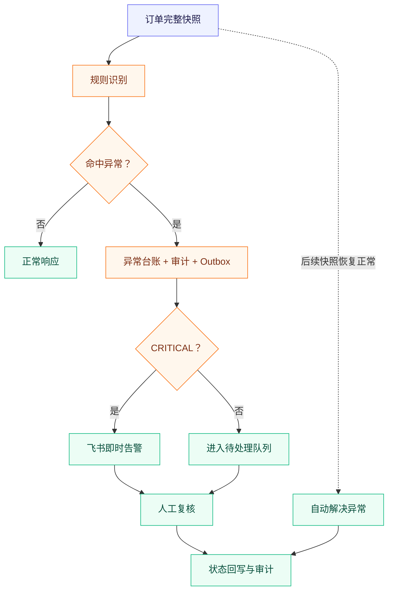

# 电商订单异常处理自动化

[](https://github.com/718232157/ecommerce-order-exception-automation/actions/workflows/ci.yml)

把订单异常的 **发现、建单、通知、复核、恢复和审计** 串成一条可运行的自动化流程。

订单从 ERP、平台适配器或 CSV 进入后，系统识别超时未发货、高风险、库存不足、退款超时和重复支付；异常写入台账，紧急事件通知飞书，处理结果可人工复核，订单恢复后自动闭环。

`n8n + FastAPI + PostgreSQL + 飞书`，本地 Docker 可完整运行。

## 它解决什么问题

| 业务问题 | 系统处理 |
|---|---|
| 运营需要人工筛查大量订单 | 实时识别，并用每 30 分钟巡检补偿遗漏 |
| 高风险订单发现晚、通知慢 | `CRITICAL` 异常立即进入飞书告警 |
| 重复事件造成重复建单和刷屏 | 事件幂等、异常唯一键和通知策略共同防重 |
| 多人同时处理导致状态互相覆盖 | 人工复核使用版本校验，过期操作返回 `409` |
| 订单恢复后异常仍长期挂起 | 新快照不再命中规则时自动解决并留下审计 |
| 飞书暂时不可用导致消息丢失 | Outbox 重试，耗尽后进入死信并由监控发现 |

## 一眼看懂流程



实时 Webhook 负责快速响应，定时巡检负责补偿；订单、异常、审计和 Outbox 在同一 PostgreSQL 事务中提交。

## 5 分钟运行

### Windows

1. 安装并启动 [Docker Desktop](https://www.docker.com/products/docker-desktop/)；
2. 下载并解压仓库；
3. 双击 `setup.cmd`。

### macOS / Linux

```bash
bash setup.sh
```

脚本会生成本地密钥、启动 PostgreSQL、API 和 n8n，并导入发布 5 条工作流。首次进入 n8n 时创建本地管理员账号，然后打开 `02-定时批量订单巡检`，点击 `Execute workflow`。

| 入口 | 地址 |
|---|---|
| n8n | <http://127.0.0.1:5678> |
| 异常台账 API | <http://127.0.0.1:8080/exceptions> |
| 运营统计 | <http://127.0.0.1:8080/stats> |
| OpenAPI 文档 | <http://127.0.0.1:8080/docs> |

停止服务使用 `stop.cmd` 或 `bash stop.sh`，数据卷会保留。本地端口只监听 `127.0.0.1`。

## 能识别哪些异常

| 异常 | 判断依据 | 默认处理 |
|---|---|---|
| 超时未发货 | 付款后超过规则时限仍未发货 | 建单，建议核查仓库和承运状态 |
| 高风险订单 | 风控评分超过阈值 | 标记 `CRITICAL`，暂停自动履约并请求复核 |
| 库存不足 | 购买数量超过可用库存 | 建单，建议锁单并协调库存 |
| 退款超时 | 退款申请超过处理时限 | 建单，建议核查退款通道 |
| 重复支付 | 上游快照标记重复款项 | 建单，建议冻结重复款项后续处理 |

规则是可运行基线，正式接入时应由业务负责人确认阈值和处置策略。系统只生成建议和复核任务，不会自动退款、冻结或取消订单。

## 好不好用：关键保障

| 保障 | 实际效果 |
|---|---|
| 幂等接入 | 同一 `eventId` 和正文重放不会重复处理；同 ID 不同正文返回 `409` |
| 异常防重 | 同一订单、同一异常类型只保留一张未解决工单 |
| 并发安全 | 复核携带 `expectedVersion`，防止后提交的人覆盖先提交的结果 |
| 自动恢复 | 最新快照恢复正常后自动解决；异常复发时重新打开原工单 |
| 通知降噪 | 默认只即时通知 `CRITICAL`，重复命中只更新台账 |
| 失败恢复 | 飞书调用异步重试，耗尽后进入 `DEAD`，支持管理员重试 |
| 全程可追溯 | 识别、复核、解决、复发和外部同步均记录审计 |

## 5 条 n8n 工作流

| 工作流 | 触发方式 | 职责 |
|---|---|---|
| 01 实时订单异常识别 | Webhook | 单条订单接入、规则判断、异常分级和响应 |
| 02 定时批量订单巡检 | 每 30 分钟 / 手动 | 扫描存量订单、补偿检测、汇总和审计 |
| 03 高风险人工复核 | Webhook | 校验当前状态和版本，保存复核结论 |
| 04 每日异常运营报告 | 每天 9 点 / 手动 | 汇总新增、待处理、解决和风险分布 |
| 05 失败任务与死信监控 | 每 10 分钟 / 手动 | 检查死信并生成受控运维告警 |

<details>
<summary><strong>查看 5 条工作流画布</strong></summary>

### 01 实时订单异常识别


### 02 定时批量订单巡检


### 03 高风险人工复核


### 04 每日异常运营报告


### 05 失败任务与死信监控


</details>

## 接入订单数据

### 企业系统

标准入口接收订单完整快照：

```text
POST /v1/orders/ingest
X-Timestamp: Unix 秒
X-Signature: hex(HMAC-SHA256(secret, timestamp + "." + 原始请求体))
```

平台适配器负责上游验签、状态映射、分页或游标、限流、脱敏和稳定事件版本。字段契约与签名示例见 [真实系统接入说明](docs/integration-guide.md)。

### CSV 或合成数据

```bash
python scripts/generate_synthetic_orders.py --count 1000 --output work/synthetic-orders.csv
bash import-orders.sh work/synthetic-orders.csv
```

Windows 也可以把 CSV 拖到 `import-orders.cmd`。生成数据带验收标签但不包含企业客户数据，场景说明见 [业务验收方案](docs/business-acceptance.md)。

## 接入飞书

双击 `configure-feishu.cmd` 或运行 `bash configure-feishu.sh`，按提示填写群机器人 Webhook、飞书应用凭证和多维表格信息。系统会创建缺失字段，后续使用保存的 Record ID 更新同一条异常记录。

```dotenv
NOTIFY_SEVERITIES=CRITICAL
ENABLE_DAILY_REPORTS=false
ENABLE_DEAD_LETTER_ALERTS=false
```

日报和死信告警默认关闭，确认目标群和消息量后再启用。完整步骤见 [飞书接入说明](docs/feishu-setup.md)。

## 如何证明它能工作

GitHub Actions 每次提交都会在隔离环境中：

1. 校验 Python、5 条 n8n 工作流、Compose、镜像版本和凭证泄漏；
2. 启动真实 PostgreSQL 与 FastAPI；
3. 验证签名、防重放、事件冲突和 20 单并发编号；
4. 验证复核版本冲突、异常复发、自动恢复和运维端点；
5. 导入并发布 n8n 工作流，实际调用订单 Webhook；
6. 销毁隔离数据卷。

```bash
python scripts/validate_project.py
python scripts/integration_test.py  # 需要已启动的隔离环境
```

集成测试检测到真实飞书配置时会拒绝运行，避免测试消息进入业务群。

## 上线前需要知道

- 仓库提供订单异常处理底座，不包含企业正式平台授权和专有字段映射。
- 本地 Docker Compose 用于体验和验收，不是高可用部署方案。
- 服务器部署时应启用读取鉴权、关闭 API 文档并开启 n8n 安全 Cookie。
- 生产接入前请完成 [上线检查清单](docs/production-checklist.md) 和 [安全说明](SECURITY.md)。

进一步阅读：[架构设计](docs/architecture.md) · [运维手册](docs/operations-runbook.md) · [高级部署](docs/advanced-deployment.md)

## License

[MIT](LICENSE)
