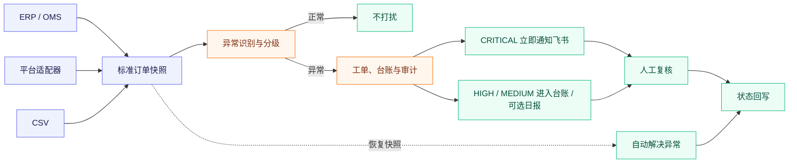

# 电商订单异常处理自动化

企业通常不是完全看不到异常，而是异常标记留在订单、仓储或退款系统的页面里，仍要运营人员反复查找；发现以后，谁处理、是否重复通知、订单恢复后是否关闭也容易断链。

这个项目提供一层独立的订单异常处置流程，不替代企业现有的订单管理系统（ERP / OMS）。订单快照从现有系统、平台连接程序（适配器）或 CSV 进入后，系统自动识别和分级：紧急异常立即通知飞书群，其他异常进入台账并可按需汇总日报；后续复核、恢复和外部同步均可追踪。

> **一句话说明**：不用运营人员持续翻查订单页面，系统自动筛出需要处理的订单；紧急事件主动找人，普通事件集中沉淀，并持续跟踪到解决。

> **进一步演进方向**：当前版本已经完成单份订单快照的异常处置闭环；下一步将关联订单、仓库与物流事件，识别单一系统难以发现的状态不一致，并根据实际卡点分配给订单运营、仓库或物流负责人。详见[下一步演进](#下一步演进跨系统履约异常)。

`n8n + FastAPI + PostgreSQL + 飞书`，本地 Docker 可完整运行。

> **数据与适用范围**：仓库不包含任何企业真实订单或个人信息。示例、截图和自动化验收均使用可复现的合成数据，用于验证流程、接口和故障边界，不代表真实企业的订单分布或业务收益。系统按真实订单异常处置链路设计；企业接入时仍需使用授权后的脱敏数据校准规则，并由业务负责人确认 SLA 和处置策略。

## 为什么值得用

成熟的 ERP、OMS 或电商平台通常已经能标记一部分风险。本项目不重复做订单管理，而是补齐异常被标记之后容易断掉的协作与追踪过程。

### 核心价值：让异常主动找人，并跟踪到业务恢复

企业真正耗费人力的往往不是在 ERP 中点击一次“暂停发货”或“退款”，而是运营人员需要持续翻查订单页面、判断优先级、通知正确负责人，并确认是否重复处理、是否已经恢复。OrderGuard 将这段容易漏单和断链的过程自动化，同时保留 ERP / OMS 作为最终业务操作和权限控制的系统：

```text
订单状态变化
→ OrderGuard 自动识别、分级和防重
→ 紧急异常主动通知处理人员，其他异常进入台账
→ 处理人员在企业现有 ERP / OMS 中执行核验、暂停履约、退款等业务动作
→ ERP / OMS 的最新订单快照再次进入 OrderGuard
→ 异常条件消失后自动解决，并同步台账与审计记录
```

因此，本项目自动化的是**异常处置与协同链路**，而不是绕过企业权限直接替代 ERP 执行高风险操作。这种“系统发现和跟踪、授权人员决策和执行”的人机协作边界，可以减少重复巡检、重复通知、无人跟进和处理后未关闭等问题，也避免规则误报直接触发退款、冻结或取消订单。

当前仓库已经实现订单接入、规则识别、分级通知、异常防重、复核接口、自动恢复、飞书台账和审计；飞书领取按钮、ERP 订单深链和独立处理页面属于后续体验增强。它们能减少操作跳转，但不是上述核心链路成立的前提。

| 当团队遇到这种情况 | 这套流程能带来什么 |
|---|---|
| ERP 已经标出异常，但运营仍要反复打开页面查看 | 实时接收与定时巡检主动筛选；`CRITICAL` 立即通知飞书，其他异常进入台账并可汇总日报 |
| 现有系统能正常使用，只缺少符合企业实际的一条规则或协同流程 | 保留原系统，通过管理 API 调整启停、阈值、等级和处理建议，并记录规则变更审计 |
| 重复扫描、多人复核或飞书临时失败容易造成刷屏、覆盖和漏单 | 事件与工单防重、复核版本校验、自动恢复、Outbox 重试和死信监控共同保证闭环 |
| 只想先在内部小范围验证，不希望为一条补充流程采购整套商业系统 | Docker 自托管；项目本身不按订单量或执行次数收费，也不占用飞书多维表格原生自动化次数 |

如果团队已经有可持续运行的电脑、Docker 和飞书环境，小范围试运行可以做到接近零新增软件授权费，并将订单数据、规则和审计记录保留在自己的环境中。这不代表长期生产运行没有主机、维护和系统接入成本。

它更适合团队主要在飞书协作，或者现有系统只有异常标记、但缺少可定制处置闭环的场景。如果企业现有平台已经完整覆盖统一识别、分级通知、负责人、复核、防重、恢复和审计，应优先复用现有能力。

## 一眼看懂流程



实时 Webhook 负责快速响应，定时巡检负责补偿；订单、异常、审计和 Outbox 在同一 PostgreSQL 事务中提交。

### 处理人员在哪里处理

当前版本把飞书群消息定位为**紧急通知入口**，把飞书多维表格定位为**异常台账**，暂未提供可直接点击处理的飞书卡片按钮或独立运营后台。处理人员收到通知后，仍在企业现有的 ERP、OMS、风控、仓储或支付系统中核验订单并执行暂停履约、协调库存、退款等业务动作；完成核验后，通过 `03-高风险人工复核` Webhook 或复核 API 提交 `APPROVED`、`REJECTED` 或 `RESOLVED` 结论。

OrderGuard 会校验异常的当前状态和版本，保存处理人、复核意见、状态变化与审计记录，并将结果同步到多维表格。系统的重点是补齐“自动发现—分级通知—防重—复核记录—恢复跟踪—审计”链路，而不是替代企业已有的订单操作界面，也不会直接执行退款、冻结、取消订单或修改库存。企业正式接入时，可以继续使用现有工单系统作为处理入口，或在此接口之上增加飞书交互卡片、审批表单或内部处理页面。

当企业适配器能够持续回传订单最新快照时，处理人员在 ERP / OMS 完成业务动作后不必仅靠人工点击“已解决”：只要新快照不再命中异常规则，OrderGuard 就会自动关闭原异常并记录恢复原因。这样既保留企业原有操作权限，又自动完成发现、通知、跟踪和闭环。

## 5 分钟运行

### Windows

1. 安装并启动 [Docker Desktop](https://www.docker.com/products/docker-desktop/)；
2. 下载并解压仓库；
3. 双击 `setup.cmd`。

### macOS / Linux

```bash
bash setup.sh
```

脚本会生成本地密钥、启动 PostgreSQL、API 和 n8n，并导入发布 5 条工作流。首次进入 n8n 时创建本地管理员账号，然后打开 `02-定时批量订单巡检`，点击 `Execute workflow`。

如果准备在企业内部小范围试运行，请不要直接连接生产订单和业务群，先按照 [企业内部试运行手册](docs/pilot-handbook.md) 完成角色分工、隔离部署、规则确认、验收和退出检查。

| 入口 | 地址 |
|---|---|
| n8n | <http://127.0.0.1:5678> |
| 异常台账 API | <http://127.0.0.1:8080/exceptions> |
| 运营统计 | <http://127.0.0.1:8080/stats> |
| OpenAPI 文档 | <http://127.0.0.1:8080/docs> |

以上是默认地址。`127.0.0.1` 始终表示安装者自己的电脑：你运行时访问你的本地环境，其他人运行时访问他们各自的本地环境，数据互不相通。如果端口被占用，可以在 `.env` 修改 `N8N_PORT` 和 `ORDER_API_PORT`，访问地址也随之变化。

停止服务使用 `stop.cmd` 或 `bash stop.sh`，数据卷会保留。本地端口只监听 `127.0.0.1`，同一局域网的其他设备默认无法访问。

## 能识别哪些异常

| 异常 | 判断依据 | 默认处理 |
|---|---|---|
| 超时未发货 | 付款后超过规则时限仍未发货 | 建单，建议核查仓库和承运状态 |
| 高风险订单 | 风控评分超过阈值 | 标记 `CRITICAL`，暂停自动履约并请求复核 |
| 库存不足 | 购买数量超过可用库存 | 建单，建议锁单并协调库存 |
| 退款超时 | 退款申请超过处理时限 | 建单，建议核查退款通道 |
| 重复支付 | 上游快照标记重复款项 | 建单，建议冻结重复款项后续处理 |

规则是可运行基线，正式接入时应由业务负责人确认阈值和处置策略。系统只生成建议和复核任务，不会自动退款、冻结或取消订单。

## 好不好用：关键保障

| 保障 | 实际效果 |
|---|---|
| 幂等接入 | 同一 `eventId` 和正文重放不会重复处理；同 ID 不同正文返回 `409` |
| 异常防重 | 同一订单、同一异常类型只保留一张未解决工单 |
| 并发安全 | 复核携带 `expectedVersion`，防止后提交的人覆盖先提交的结果 |
| 自动恢复 | 最新快照恢复正常后自动解决；异常复发时重新打开原工单 |
| 通知降噪 | 默认只即时通知 `CRITICAL`，重复命中只更新台账 |
| 失败恢复 | 飞书调用异步重试，耗尽后进入 `DEAD`，支持管理员重试 |
| 全程可追溯 | 识别、复核、解决、复发和外部同步均记录审计 |

## 5 条 n8n 工作流

| 工作流 | 触发方式 | 职责 |
|---|---|---|
| 01 实时订单异常识别 | Webhook | 单条订单接入、规则判断、异常分级和响应 |
| 02 定时批量订单巡检 | 每 30 分钟 / 手动 | 扫描存量订单、补偿检测、汇总和审计 |
| 03 高风险人工复核 | Webhook | 校验当前状态和版本，保存复核结论 |
| 04 每日异常运营报告 | 每天 9 点 / 手动 | 汇总新增、待处理、解决和风险分布 |
| 05 失败任务与死信监控 | 每 10 分钟 / 手动 | 检查死信并生成受控运维告警 |

<details>
<summary><strong>查看 5 条工作流画布</strong></summary>

### 01 实时订单异常识别


### 02 定时批量订单巡检


### 03 高风险人工复核


### 04 每日异常运营报告


### 05 失败任务与死信监控


</details>

## 接入订单数据

### 企业系统

标准入口接收订单完整快照：

```text
POST /v1/orders/ingest
X-Timestamp: Unix 秒
X-Signature: hex(HMAC-SHA256(secret, timestamp + "." + 原始请求体))
```

平台适配器负责上游验签、状态映射、分页或游标、限流、脱敏和稳定事件版本。字段契约与签名示例见 [真实系统接入说明](docs/integration-guide.md)。

### CSV 或合成数据

```bash
python scripts/generate_synthetic_orders.py --count 1000 --output work/synthetic-orders.csv
bash import-orders.sh work/synthetic-orders.csv
```

Windows 也可以把 CSV 拖到 `import-orders.cmd`。生成数据带验收标签但不包含企业客户数据，场景说明见 [业务验收方案](docs/business-acceptance.md)。

## 接入飞书

双击 `configure-feishu.cmd` 或运行 `bash configure-feishu.sh`，按提示填写群机器人 Webhook、飞书应用凭证和多维表格信息。系统会创建缺失字段，后续使用保存的 Record ID 更新同一条异常记录。

```dotenv
NOTIFY_SEVERITIES=CRITICAL
ENABLE_DAILY_REPORTS=false
ENABLE_DEAD_LETTER_ALERTS=false
```

日报和死信告警默认关闭，确认目标群和消息量后再启用。完整步骤见 [飞书接入说明](docs/feishu-setup.md)。

## 如何证明它能工作

GitHub Actions 每次提交都会在隔离环境中：

1. 校验 Python、5 条 n8n 工作流、Compose、镜像版本和凭证泄漏；
2. 启动真实 PostgreSQL 与 FastAPI；
3. 验证签名、防重放、事件冲突和 20 单并发编号；
4. 验证复核版本冲突、异常复发、自动恢复和运维端点；
5. 导入并发布 n8n 工作流，实际调用订单 Webhook；
6. 销毁隔离数据卷。

```bash
python scripts/validate_project.py
python scripts/integration_test.py  # 需要已启动的隔离环境
```

集成测试检测到真实飞书配置时会拒绝运行，避免测试消息进入业务群。

## 下一步演进：跨系统履约异常

当前版本根据一份标准订单快照判断异常。下一步计划接入订单、仓库管理系统（WMS）和物流事件，发现单个系统难以识别的状态不一致：

```text
订单系统：订单已付款
仓库系统：超过 SLA 仍无出库单
物流系统：没有揽收或轨迹长时间未更新
                         ↓
关联订单与证据 → 判断卡点和风险等级 → 通知对应负责人 → 跟踪到恢复
```

演进顺序：

1. 定义订单、仓库和物流数据的统一格式；
2. 按订单号和时间线关联不同系统的状态；
3. 增加“已付款未出库”“已出库未揽收”“物流停滞”等规则；
4. 根据卡点把任务分配给订单运营、仓库或物流负责人；
5. 使用企业授权的脱敏数据校准 SLA 和通知策略。

这条路线的价值不是替换成熟的订单管理系统，而是在企业保留现有系统的情况下，补充其尚未覆盖的自定义规则和飞书协同流程。如果现有系统已经完整覆盖相同能力，应直接复用现有系统。

### 使用成本和飞书配额

本地体验只需要 Docker。本仓库不按订单量或执行次数收费；当前实现直接调用飞书 OpenAPI 和群机器人，也**不消耗飞书多维表格原生自动化流程的每月运行次数**。

企业长期运行时仍需要一台持续在线的内部电脑或云主机，并需要把现有订单系统的字段转换成项目支持的标准格式。飞书 OpenAPI 和机器人有独立的调用频率限制，系统通过通知降噪和 Outbox 重试进行保护。详细部署和限制见[高级部署](docs/advanced-deployment.md)与[飞书开放平台频控策略](https://open.feishu.cn/document/server-docs/api-call-guide/frequency-control?lang=zh-CN)。

这部分是后续路线图；当前仓库尚未内置具体企业的仓库或物流平台连接程序。

## 上线前需要知道

- 仓库提供订单异常处理底座，不包含企业正式平台授权和专有字段映射。
- 本地 Docker Compose 用于体验和验收，不是高可用部署方案。
- 服务器部署时应启用读取鉴权、关闭 API 文档并开启 n8n 安全 Cookie。
- 生产接入前请完成 [上线检查清单](docs/production-checklist.md) 和 [安全说明](SECURITY.md)。

进一步阅读：[企业内部试运行手册](docs/pilot-handbook.md) · [架构设计](docs/architecture.md) · [运维手册](docs/operations-runbook.md) · [高级部署](docs/advanced-deployment.md)

## License

[MIT](LICENSE)
