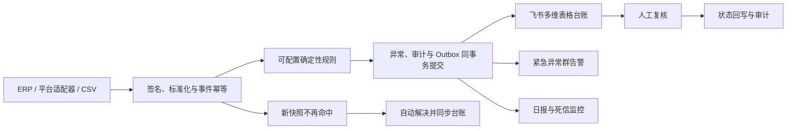

# 电商订单异常处理自动化系统

[](https://github.com/718232157/ecommerce-order-exception-automation/actions/workflows/ci.yml)

面向电商运营、风控、仓储和售后的订单异常闭环：接收订单完整快照，识别超时未发货、高风险、库存不足、退款超时和重复支付，自动建立异常台账，向飞书发送紧急告警，并支持人工复核、恢复闭环、日报和失败任务处置。

项目使用合成订单和脱敏样例做可复现验收，不包含任何企业客户数据，也不伪造淘宝、京东、抖店等平台授权。飞书、n8n、PostgreSQL、Webhook 和事务链路均可在本地真实运行。

## 10分钟看到完整流程

### Windows

1. 安装并启动 [Docker Desktop](https://www.docker.com/products/docker-desktop/)；
2. 下载并解压仓库；
3. 双击 `setup.cmd`。

脚本会生成本地密钥、启动 PostgreSQL/API/n8n、导入并发布5条工作流，最后打开 n8n。首次进入 n8n 时创建本地管理员账号，然后打开 `02-定时批量订单巡检`，点击 `Execute workflow`。

### macOS / Linux

```bash
bash setup.sh
```

随后访问：

- n8n：<http://127.0.0.1:5678>
- 异常台账 API：<http://127.0.0.1:8080/exceptions>
- 运营统计：<http://127.0.0.1:8080/stats>
- OpenAPI 文档：<http://127.0.0.1:8080/docs>

本地端口只监听 `127.0.0.1`。停止服务使用 `stop.cmd` 或 `bash stop.sh`，数据卷会保留。

## 业务闭环



### 状态与并发规则

- 同一 `eventId` 重放不会重复处理；同 ID 不同正文返回 `409`。
- 同一订单、同一异常类型只保留一张异常工单。
- `PENDING_REVIEW → APPROVED/REJECTED/RESOLVED`，`APPROVED → RESOLVED`。
- 人工复核必须携带读取时的 `expectedVersion`；过期操作返回 `409`，防止多人覆盖。
- 最新订单完整快照不再命中规则时，待处理异常自动解决，并记录审计事件。
- 已解决/已驳回异常再次命中时重新打开，不创建重复台账。

## 五条 n8n 工作流

| 工作流 | 触发方式 | 业务职责 |
|---|---|---|
| 01 实时订单异常识别 | Webhook | 单条订单接入、异常分级和响应 |
| 02 定时批量订单巡检 | 每30分钟/手动 | 批量读取订单、逐单检查、汇总和审计 |
| 03 高风险人工复核 | Webhook | 状态校验、并发版本检查、复核和回写 |
| 04 每日异常运营报告 | 每天9点/手动 | 新增、待处理、解决和风险分布 |
| 05 失败任务与死信监控 | 每10分钟/手动 | 检查死信并生成受控运维告警 |

## 飞书集成与通知策略

双击 `configure-feishu.cmd` 或运行 `bash configure-feishu.sh`，按提示填写群机器人 Webhook、飞书应用凭证、多维表格 Token 和 Table ID。系统会创建缺失字段，并将后续异常写入真实台账。

默认即时通知只有 `CRITICAL`，避免高频业务异常刷屏：

```dotenv
NOTIFY_SEVERITIES=CRITICAL
```

可按企业策略调整为 `CRITICAL,HIGH`。重复命中的未解决异常只更新台账，不重复发群消息。日报和死信告警默认关闭，确认目标群后再启用：

```dotenv
ENABLE_DAILY_REPORTS=true
ENABLE_DEAD_LETTER_ALERTS=true
```

飞书配置见 [飞书接入步骤](docs/feishu-setup.md)。高风险动作只生成建议和复核任务，系统不会自动退款、冻结或取消订单。

## 可复现的合成业务数据

生成1000条带标准答案的完整订单快照：

```bash
python scripts/generate_synthetic_orders.py \
  --count 1000 \
  --seed 20260812 \
  --as-of 2026-08-12T12:00:00+08:00 \
  --output work/synthetic-orders.csv
```

数据默认包含80%正常订单，以及超时未发货、高风险、库存不足、退款超时、重复支付和多异常叠加。`expectedExceptionTypes` 是验收标签，导入时不会进入订单业务字段。

导入生成的 CSV：

```bash
bash import-orders.sh work/synthetic-orders.csv
```

Windows 可把 CSV 拖到 `import-orders.cmd`。详细验收场景和判定标准见 [业务验收方案](docs/business-acceptance.md)。

## 接入企业系统

标准入口：

```text
POST /v1/orders/ingest
X-Timestamp: Unix 秒
X-Signature: hex(HMAC-SHA256(secret, timestamp + "." + 原始请求体))
```

输入必须是订单的完整业务快照，而不是只包含变化字段的补丁。平台适配器负责平台验签、状态映射、分页/游标、限流、脱敏和稳定的事件版本。字段契约与签名示例见 [真实系统接入说明](docs/integration-guide.md)。

## 一致性与失败恢复

- PostgreSQL 事务保证订单、异常、审计和 Outbox 一起提交。
- 多 Worker 使用 `FOR UPDATE SKIP LOCKED` 竞争消费。
- 飞书失败采用指数退避，达到上限进入 `DEAD`，由管理员确认后重试。
- 飞书多维表格以异常编号和保存的 Record ID 做最终一致性更新。
- 每日业务编号在数据库事务中生成，并发验收会检查其唯一性。

实现与边界见 [架构设计](docs/architecture.md)，日常处置见 [运维手册](docs/operations-runbook.md)。

## 安全模式

本地体验默认允许读取本机台账。服务器部署时必须启用：

```dotenv
PROTECT_READ_ENDPOINTS=true
READ_API_KEY=<独立随机密钥>
ENABLE_API_DOCS=false
N8N_SECURE_COOKIE=true
```

写接口分别使用外部 HMAC、`INTERNAL_API_KEY`、`REVIEW_API_KEY` 和 `ADMIN_API_KEY`。生产接入前请完成 [上线检查清单](docs/production-checklist.md) 和 [安全说明](SECURITY.md)。

## 自动化验证

GitHub Actions 每次提交会执行：

1. Python、工作流结构、镜像版本和凭证扫描；
2. Docker Compose 配置校验；
3. 启动真实 PostgreSQL 和 API；
4. 验证签名、防重放、事件冲突、20单并发编号、复核版本冲突、异常重新打开、自动恢复和运维端点；
5. 销毁隔离的 CI 数据卷。

```bash
python scripts/validate_project.py
python scripts/integration_test.py  # 需要已启动的隔离环境
```

集成测试会在检测到真实飞书配置时拒绝运行，除非明确设置 `ALLOW_LIVE_NOTIFICATIONS=true`，防止测试消息进入业务群。

## 项目边界

- 仓库提供订单异常处理底座，不包含企业正式平台凭证和专有字段映射。
- 默认规则阈值只是可运行基线，上线前必须由业务负责人确认。
- 确定性规则负责金额、库存、时效和风险阈值；大模型适合后续处理客服留言、退款原因等非结构化信息，但其输出仍需规则校验和人工复核。
- 本地 Compose 不是高可用生产部署方案。

## License

[MIT](LICENSE)
